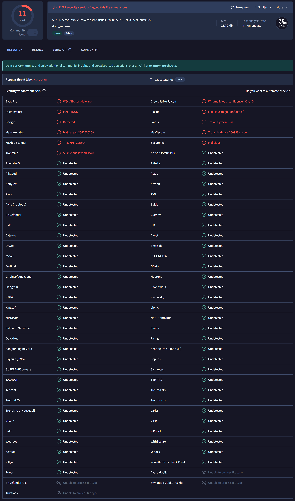

# DD2391-Project

# Ransomware "Bad Day"

## Overview

"Bad Day" is a proof-of-concept ransomware that encrypts files on a system using AES encryption. The AES key is then encrypted with an RSA public key and sent to a remote server (who owns the private key). The user is prompted to pay a ransom to retrieve the decryption key.

This program is a student project and for educational purposes only. 

## Features

- **File Encryption:** Uses AES in CTR mode.
- **File Decryption:** Unlocks files if the correct key is provided.
- **Ransom UI:** A Tkinter window demands a ransom payment for decryption.
- **Targeted File Types:** The program targets known "productivity file formats" such as `.docx`, `.pdf`, but also video and image files like example `.jpg`, and `.mp4`.
- **Public Key Encryption:** AES keys are sent encrypted using a RSA public key to a remote server for storage.
- **Anti-virus protection:** A mixture of payload encryption, string encryption, random file sizes and compilation is used to prevent anti-virus detection.

## How The Ransomware Works

### Encryption:
1. The program searches for files of supported types.
2. Files are encrypted with AES.
3. The AES key is encrypted with RSA and sent to the server.
4. AES key is removed from memory.

### Decryption:
1. The user provides a decryption key.
2. Files are decrypted if the correct key is entered.

## Usage

### Pre-requisites:
- Python 3.x
- Libraries: `pycryptodome`, `tkinter`, `requests`
- Config: Create a `config.py` file in the Malware directory to configure the C2 server host address. 


# Ransomware C2 Server

## Overview

The C2 server handles key generation and distribution for the ransomware. It provides the RSA public key to the client and stores the AES key decrypted by the client.

## Features

- **RSA Key Management:** Generates/stores a 2048-bit RSA key pair.
- **Public Key Endpoint:** Provides the RSA public key.
- **AES Key Storage:** Stores encrypted AES keys from the client.

## Endpoints

1. `/key` (GET): Returns the RSA public key.
2. `/bad_day_key` (POST): Stores the AES key encrypted by the client.
3. `/docs` (GET): Returns API documentation.

## Usage

### Pre-requisites:
- Python 3.x
- Libraries: `pycryptodome`, `fastapi`, `uvicorn`, `pydantic`


### Running:

```bash
fastapi run c2serv.py
```


# Payload Encryptor

## Overview

The `encrypt_payload.py` script encrypts Python payloads using AES in CBC mode. It provides extra features such as compilation, string encryption and randomized file size.

## Features

- **AES Encryption (CBC Mode):** Encrypts payloads securely.
- **Random Variables:** Uses random variable names to obfuscate decryption program.
- **Executable Compilation:** Optionally compiles the payload into an executable.
- **String encryption:** Encrypts all source code strings using AES in ECB mode.
- **Randomized file size:** Appends a random string variable of random length between 5e4 and 1e7.

## Usage

### Pre-requisites:
- Python 3.x
- Libraries: `typer`, `numpy`, `pycryptodome`, `nuitka`

### Commands:

To encrypt payload
```bash
python encrypt_payload.py <payload_path> <save_path>
```

To compile:

```bash
python encrypt_payload.py <payload_path> <save_path> --compile
```

To encrypt strings:

```bash
python encrypt_payload.py <payload_path> <save_path> --encrypt-strings
```

To randomize file size:

```bash
python encrypt_payload.py <payload_path> <save_path> --random-size
```

Help page:

```bash
python encrypt_payload.py --help
```

## Testing
Using a fully up-to-date virtual machine running windows we have been mostly successful. 
We have been able to encrypt the entire disk, send the encrypted key back to the C2 server and finally been able to decrypt the entire disk. 
We were able to bypass the windows anti-virus software (windows defender) initially. 
However, since we allowed windows to automatically upload potential threats to Microsoft, the next day windows was able to identify our virus and stop it from executing.
This lead us to implement more anti-virus prevention techniques (string encryption and randomized file size) and were once again able to bypass the security.
We know that Microsoft analysed our virus because we saw pings from Microsoft owned ip addresses to our C2 server which was a rather interesting sight.

Testing our virus evasive capabilities on the popular site [virustotal.com](https://www.virustotal.com/gui/home/upload) we found that it only recieved a 15% detection rate, bypassing major anti-virus software such as Microsoft, BitDefender, Symantec and Kaspersky.
Link to the report: [https://www.virustotal.com/gui/file/537917c2e5c4b9b3e52c52c4b3f7250c0a49380b5c2655709938c77f1bbc9808/detection](https://www.virustotal.com/gui/file/537917c2e5c4b9b3e52c52c4b3f7250c0a49380b5c2655709938c77f1bbc9808/detection)

<p align="center">
  
</p>

## References
- [Ransomware: Recent advances, analysis, challenges and future research directions](https://www.sciencedirect.com/science/article/pii/S016740482100314X)
- [Common Antivirus Bypass Techniques](https://www.lmgsecurity.com/common-antivirus-bypass-techniques/)
- [Antivirus and EDR Bypass Techniques](https://www.vaadata.com/blog/antivirus-and-edr-bypass-techniques/)
  
## Legal Disclaimer

Legal Disclaimer
This software is intended for educational and research purposes only. The developers do not support or condone the use of ransomware or any malicious software in real-world environments. Unauthorized use of this code is illegal and may result in criminal prosecution, fines, or imprisonment.

The authors are not responsible for any misuse or damage caused by this software. Always comply with relevant laws and seek permission before testing or using this code.
